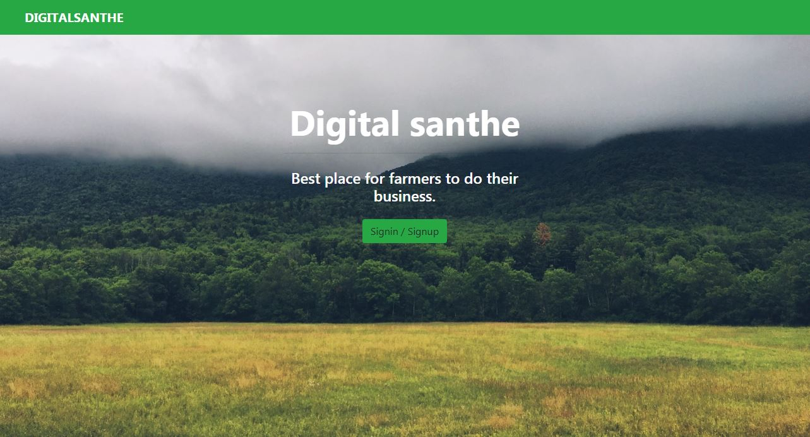
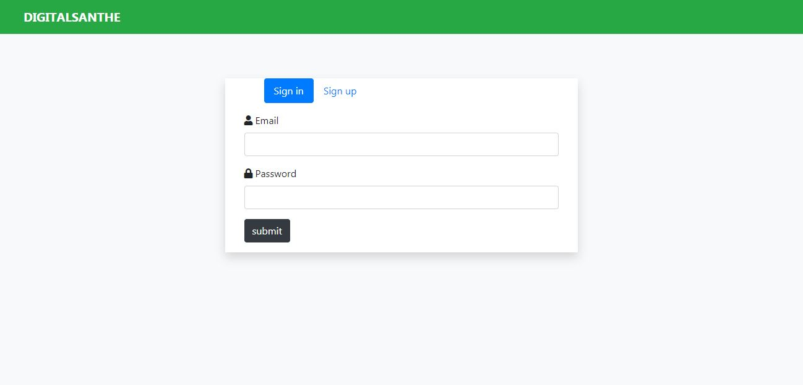
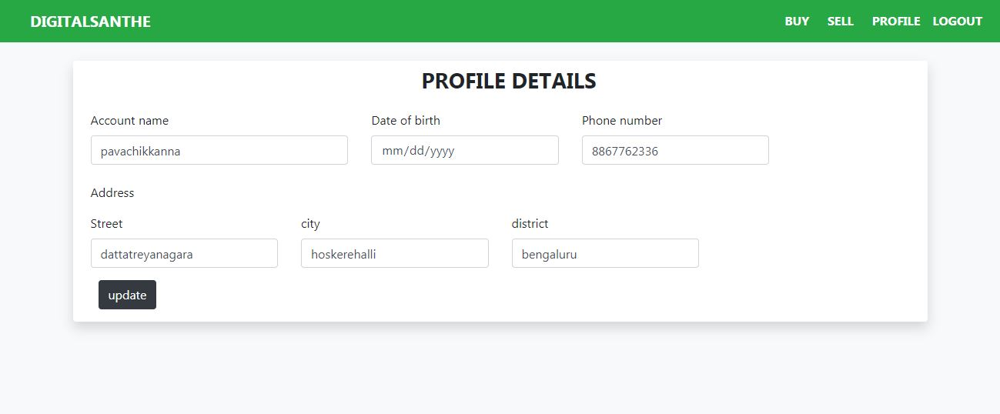
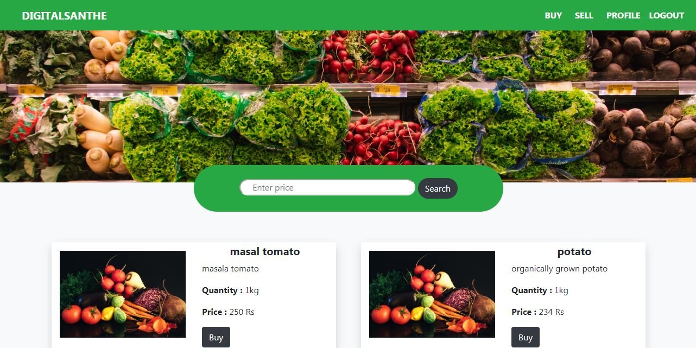
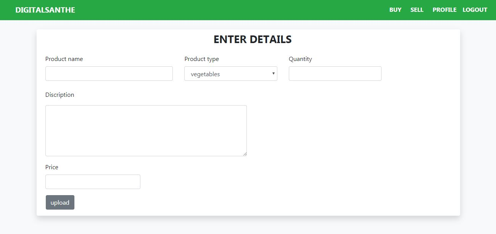

# Digital santhe
A digital market for farmers to do their business. Here they can sell their products and also buy from others.

# Developed with

**Front end :** HTML5, CSS3, Bootstrap4  

**Back end :** Django 2.2

**Database :** SQL

# Screenshots :camera:
* Landing page

* Authentication page

* Profile page

* Buy page

* Sell form page

Thank you :blush:

